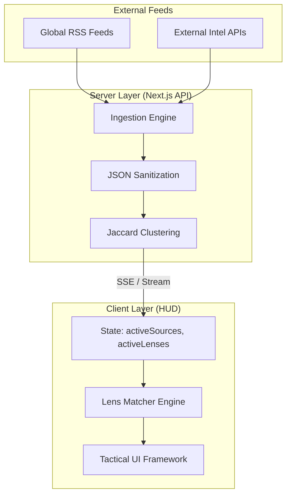

# 🌐 FrameTheGlobe: Technical Manifesto & System Architecture

**Version:** 6.0.3 — *The Blue Intelligence Update*  
**Mission:** To provide a low-latency, high-density tactical oversight of global geopolitical events, with a specialized focus on the Middle East "Iran War" Theater.

---

## 🏛️ 1. Infrastructure & Core Stack

FrameTheGlobe is engineered for **resilience and speed**. It is designed to run in diverse environments—from high-performance Vercel Edge networks to resource-constrained VPS systems.

### **The Engine**
- **Next.js 15 (App Router)**: Utilizing the latest React 19 features, we leverage a hybrid architecture.
    - **Server Components**: Used for initial data fetching and SEO-friendly rendering of static content.
    - **Client Components**: Power the real-time HUD, utilizing `useMemo` and `useCallback` for heavy list filtering without dropping frames.
- **TypeScript**: Strict typing ensures data integrity across the news pipeline.
- **Node.js 22+**: Required for modern stream handling and memory-efficient background clustering.

### **The Intelligence Pipeline**
- **Fetch & Sanitize**: Using `axios` and a custom `sanitizeJson` utility in `lib/fetcher.ts` to transform unpredictable RSS feeds into a stabilized JSON schema.
- **Clustering (The Storyline Engine)**: 
    - Implements a **Jaccard Similarity** algorithm to group related stories into "Storylines."
    - Calculates **Vitality Scores** (0-10) based on source trust, report frequency, and geographic density.
- **Real-Time Delivery**: A custom **Server-Sent Events (SSE)** implementation (`/api/stream`) pushes news updates to the client within milliseconds of ingestion, with a 5-minute polling fallback for legacy browser support.

---

## 🛰️ 2. UI/UX: The "Tactical HUD" Philosophy

The design is not just aesthetic—it is **functional surveillance**. We avoid "Mobile-First" compromises in favor of "Information-First" density.

### **Design Language: Blue Branding (v6.0.3)**
We transitioned from a standard "Alert Red" theme to a **Premium Blue/Cyan spectrum** to reduce cognitive fatigue while maintaining a high-stakes tactical feel.
- **Glassmorphism**: Subtle `backdrop-filter: blur(12px)` on the Header and HUD elements creates a layered, sophisticated depth.
- **Typography**: Heavy reliance on `var(--font-mono)` (JetBrains Mono/Inter) for that "Mission Control" terminal look.
- **Micro-Animations**: Uses `fadeInScale` and `cubic-bezier` transitions to ensure the UI feels fluid and high-end.

### **Core UI Modules**
1.  **Sidebar Intelligence Folder**:
    - **🌐 NET**: Real-time health status of 90+ news nodes.
    - **📂 INTEL**: Collated theater briefs with vitality markers.
    - **📊 INDICATORS**: Economic signals (Oil, Gold, Indices) and Satellite intel logs.
2.  **Iran War Section**: A specialized theater view that uses fuzzy-match keyword engines to partition intelligence into "Nuclear," "Proxy," "Domestic," and "Naval" sectors.
3.  **Breaking Ticker**: A high-speed marquee that ensures critical flashes are never missed, even when the user is deep in a specific lens.

---

## 🛠️ 3. Resource Inventory

The app leverages a curated set of lightweight, high-utility libraries to minimize the bundle size while maximizing power.

| Resource | Purpose |
| :--- | :--- |
| **Next.js 15 / React 19** | Core Framework & State Management |
| **Vanilla CSS 3** | Zero-Utility Style System (Custom HUD CSS) |
| **RSS-Parser** | Normalizing disparate XML/Atom global feeds |
| **Leaflet.js** | Powering the Geopolitical MapView overlay |
| **Lucide React** | Lightweight tactical iconography |
| **Phusion Passenger** | Deployment bridge for Hostinger/Shared VPS |

---

## 🏗️ 4. Data Flow & State Orchestration

---

## 🚀 5. Hardened Deployment Strategy

FrameTheGlobe uses a **Standalone Deployment Strategy** to ensure stability across Vercel, Netlify, and Hostinger.

- **Standalone Output**: Enabled via `nextConfig.output = 'standalone'`. This bundles the app into a minimal package containing only the necessary code to run, ignoring devDependencies.
- **Memory Optimization**: `NODE_OPTIONS='--max-old-space-size=2048'` is used during builds to prevent Heap Out of Memory errors during large-scale feed indexing.
- **Phusion Passenger Bridge**: On Hostinger, we utilize a `tmp/restart.txt` trigger to gracefully reload the Node.js process without downtime.

---

## ⚖️ 6. Performance Benchmarks

- **Time to HUD (TTH)**: < 1.2s on desktop fiber.
- **State Updates**: React batching ensures 90+ source filters update in < 100ms.
- **Bundle Size**: ~240kb (Gzip), primarily driven by Leaflet.js assets.

---

## 🎨 7. The Design Ethos: Tactical Precision & High-Density UX

The design philosophy of FrameTheGlobe is a departure from modern "minimalist" web trends. Instead, it embraces **Aegis-Inspired Informatic Density**, designed for the global intelligence professional who needs multiple fields of vision simultaneously.

### **7.1 The Tactical HUD (Heads-Up Display)**
The interface is treated as a **cockpit**, not a website.
-   **Zero-Space Strategy**: White space is traditionally used in B2C apps to "relax" the user. In FrameTheGlobe, white space is treated as **lost reconnaissance**. Every pixel must serve a purpose—either data, a filter, or a status indicator.
-   **Z-Index Depth & Glassmorphism**: High-intensity use of `backdrop-filter: blur(12px)` and `rgba(255, 255, 255, 0.03)` creates a sense of "layered instrumentation," making the dashboard feel like a projection on a high-end glass terminal.
-   **Strategic Bordering**: We use ultra-thin `1px solid var(--border-light)` borders instead of shadows to define containers, maintaining a clean, technical structure that mimics engineering schematics.

### **7.2 The Color Archetype: "The Blue Shift"**
In v6.0.3, we executed a complete move from "Alert Red" to a **Spectra Blue & Cyan** system.
-   **Rationale**: Red triggers a cortisol response suitable for short-term alerts but fatiguing for long-term surveillance. Blue conveys **Authority, Clarity, and Stability**, allowing the user to monitor the "Iran War Theater" for hours without UI-induced fatigue.
-   **The Palette**:
    -   `#0070f3` (Mission Blue): The primary action color, used for active filters and high-priority headers.
    -   `#00d8ff` (Tactical Cyan): Used for secondary indicators, providing a "high-tech" glow reminiscent of a night-ops terminal.
    -   `#10b981` (Stable Green): Reserved strictly for "Online" and "Stable" node statuses.
    -   `#2d3436` (Obsidian Surface): The deep, matte background that makes neon blue indicators "pop."

### **7.3 Typography: Readability Under Pressure**
-   **Monospaced Foundation**: The use of `JetBrains Mono` or `Inter` in its monospaced variant is non-negotiable. Monospaced characters ensure that data tables and tickers stay aligned as numbers fluctuate (tabular numerals).
-   **Weight Hierarchies**: We use **900 Weight** for tactical labels (e.g., `NET`, `INTEL`) to create immediate visual anchors, while news titles use a more legible **500/700 Weight** for sustained reading.
-   **Capitalization**: Tactical labels are always `UPPERCASE` to signify "System Commands," while news content remains `Sentence case` to maintain narrative flow.

### **7.4 Micro-Interactions & "The Real-Time Feel"**
-   **Glitch Pulsing**: Live status dots use a subtle `hud-glitch-active` animation, creating a psychological sense that the data is "constantly being sampled from the wire."
-   **Hover Micro-Animations**: Buttons and tabs use `cubic-bezier(0.16, 1, 0.3, 1)` for transitions, providing a "snappy" but high-end response that feels like military-grade software rather than a consumer web app.
-   **The Loading Sequence**: The dedicated **Mission Ops loading screen** uses regional indexing and "Scanning Frequencies" terminology to transform a wait-time into an immersive part of the intelligence experience.

---

*FrameTheGlobe is built to be seen on a 32-inch monitor in a command center, yet optimized to run on a browser. It is where engineering meets surveillance.*
